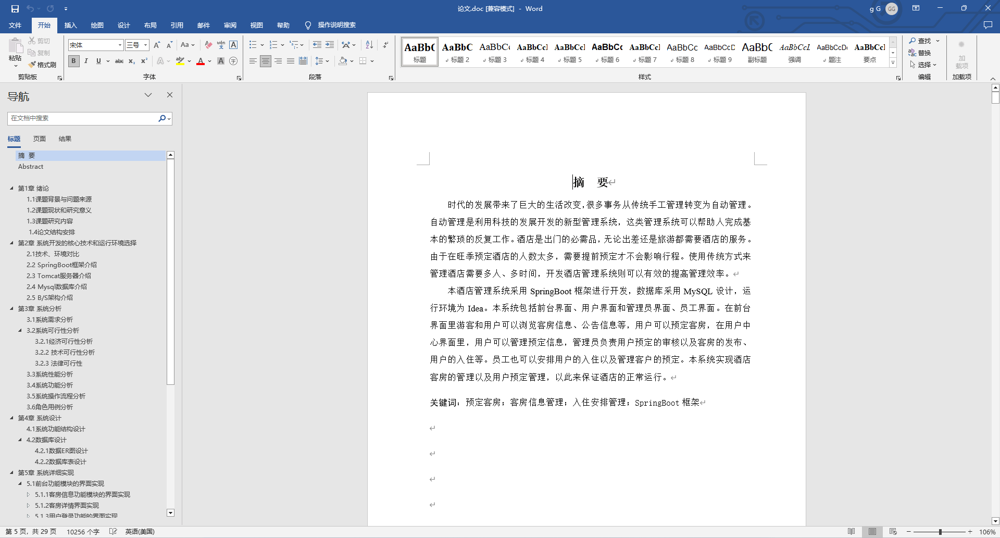
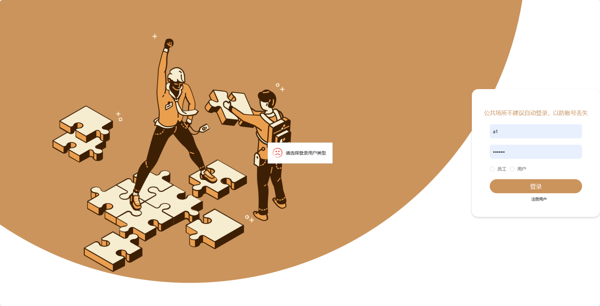
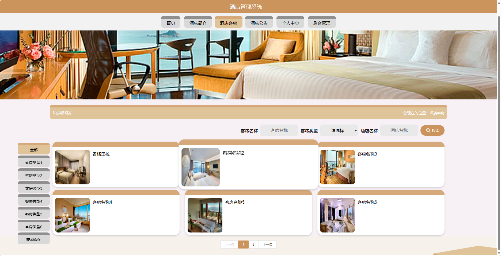
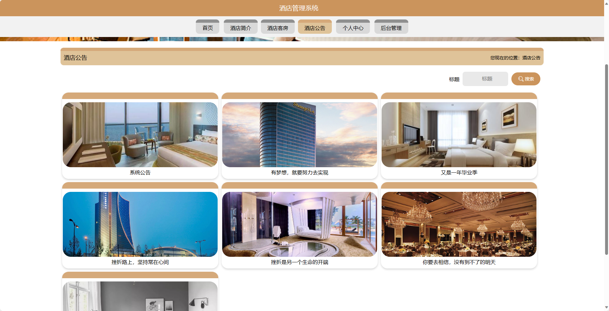
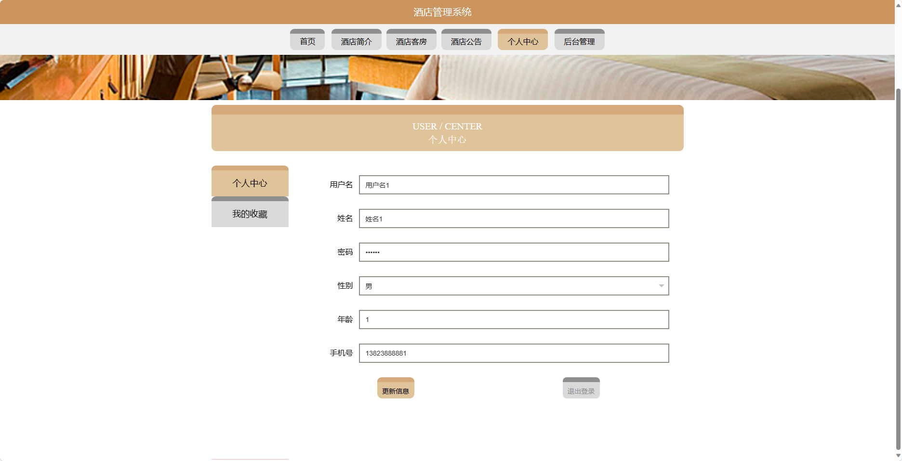
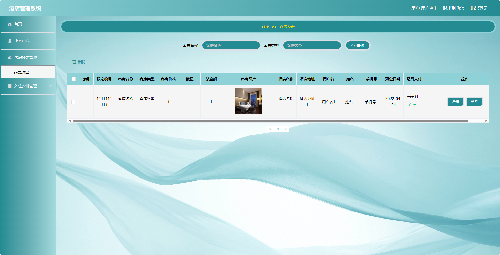
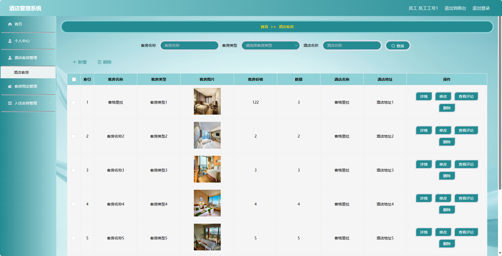
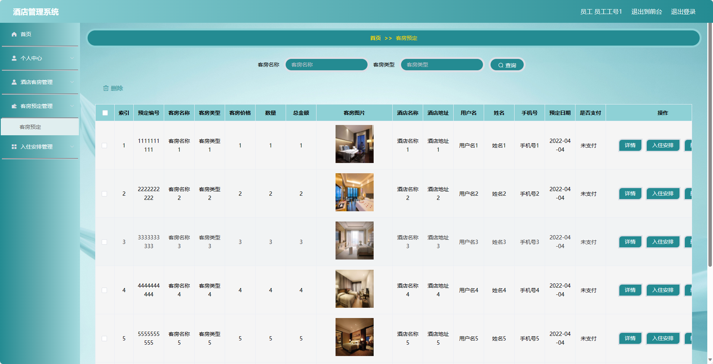
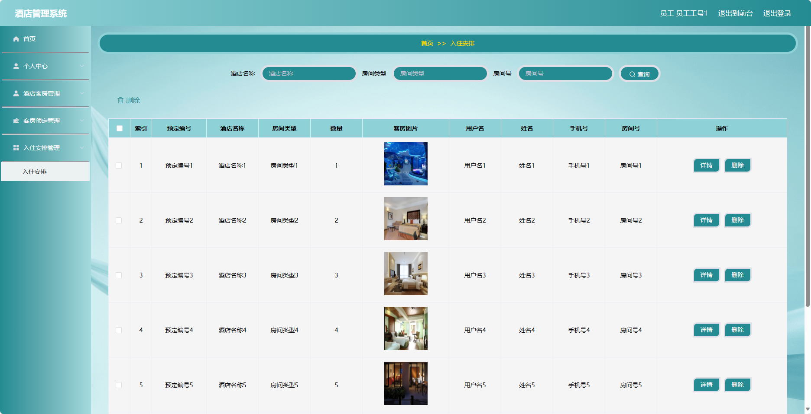

## 基于SpringBoot的酒店管理系统(程序+报告)

###  获取sql数据库文件: 从戎源码网 (https://armycodes.com/) QQ: 386869957 QQ群: 377586148
###  所有系统地址: (https://github.com/YuLin-Coder/AllProjectCatalog) 
###  所有项目以及源代码本人均调试运行无问题 可支持远程安装部署调试、定制修改、代码讲解

## 项目介绍
基于SpringBoot的酒店管理系统，系统包含两种角色：管理员、用户,系统分为前台和后台两大模块，主要功能如下。

### 【管理员】:
- 个人中心：管理个人信息，包括修改个人信息、查看订单记录等。
- 员工管理：管理酒店的员工信息，包括添加、编辑、删除员工等操作。
- 用户管理：管理酒店的用户信息，包括添加、编辑、删除用户等操作。
- 客房类型管理：管理酒店的客房类型信息，包括添加、编辑、删除客房类型等操作。
- 酒店简介管理：管理酒店的简介信息，包括编辑、更新酒店简介等操作。
- 酒店客房管理：管理酒店的客房信息，包括添加、编辑、删除客房等操作。
- 客房预定管理：管理客房的预定信息，包括查看、确认、取消预定等操作。
- 入住安排管理：管理客房的入住安排，包括分配客房、修改入住信息等操作。
- 系统管理：管理系统的基础数据，包括轮播图信息、通知公告等。

### 员工：
- 个人中心：管理个人信息，包括修改个人信息、查看订单记录等。
- 酒店客房管理：管理酒店的客房信息，包括添加、编辑、删除客房等操作。
- 客房预定管理：管理客房的预定信息，包括查看、确认、取消预定等操作。
- 入住安排管理：管理客房的入住安排，包括分配客房、修改入住信息等操作。

### 【前台】:
- 首页：展示酒店的一些基本信息和轮播图。
- 酒店简介：展示酒店的基本介绍、位置等信息。
- 酒店客房：用户可以查看酒店的客房类型、价格、设施等信息，并进行客房预定。
- 酒店公告：展示酒店的公告信息，包括优惠活动、服务通知等。
- 个人中心：管理个人信息，包括修改个人信息、查看订单记录等。

## 项目技术
- 编程语言：Java
- 数据库：MySQL
- 项目管理工具：Maven
- 前端技术：HTML、CSS、JavaScript、Jquery、Vue
- 后端技术：Spring、SpringMVC、MyBatis

## 运行环境
- JDK版本：JDK1.8及以上
- 开发工具：IDEA、Ecplise、Myecplise都可以
- 数据库: MySQL5.7及以上
- Maven：maven3.0及以上
- Node：14.14.0及以上

## 运行截图

